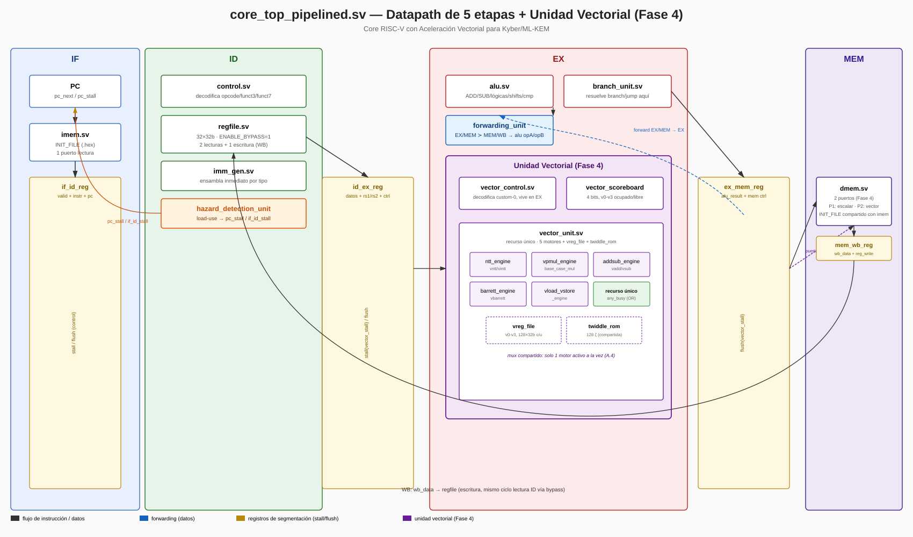
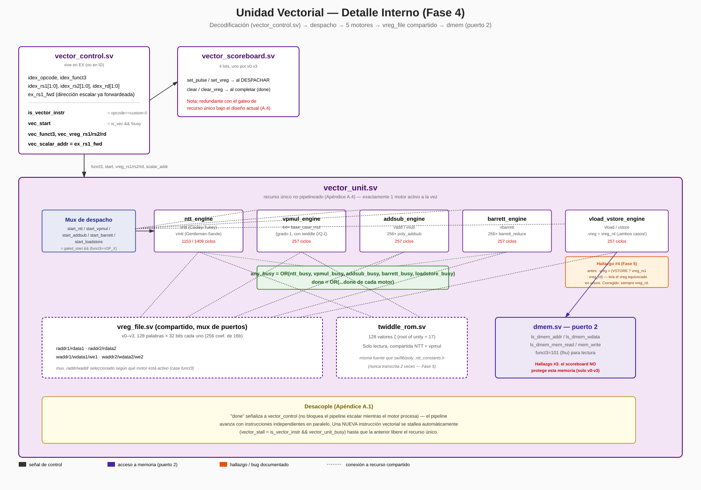
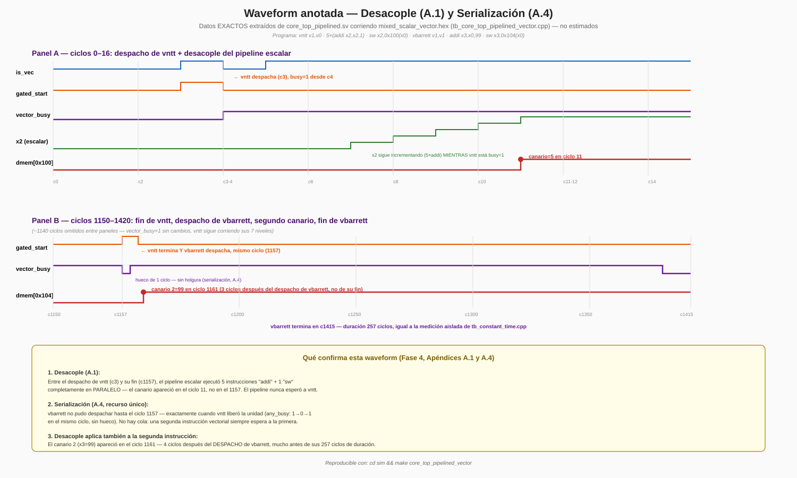
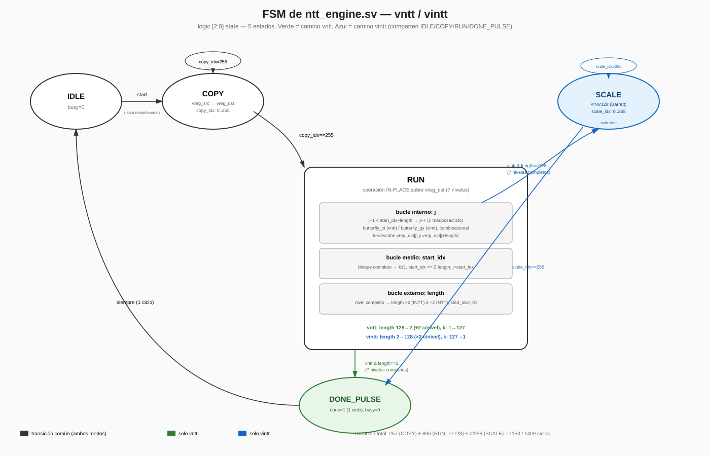
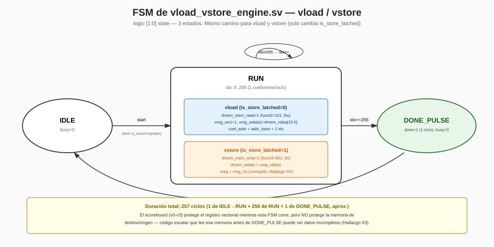

# Core RISC-V con Aceleración Vectorial para Kyber/ML-KEM

Core RV32I de 5 etapas, diseñado desde cero, con una extensión ISA
vectorial custom integrada **directamente al pipeline** (no como
coprocesador externo) para acelerar Kyber/ML-KEM-512: NTT, reducción
modular Barrett, y la aritmética de polinomios que ese protocolo
post-cuántico necesita. Continuación de mi TFG (RVV-lite, un
coprocesador vectorial sobre PicoRV32 vía interfaz PCPI) — este
proyecto reemplaza esa integración externa por instrucciones nativas
del pipeline, y reemplaza la reducción modular especializada por
Barrett genérico (generalizable a otros primos, ver sección de
decisiones de diseño).

**Estado: el protocolo ML-KEM-512 completo — keygen, encapsulation, y
decapsulation, incluyendo el mecanismo de rechazo implícito — corre de
punta a punta en el core, verificado en cada capa disponible: contra
`kyber-py`, contra los vectores de prueba oficiales de NIST, con
múltiples semillas, con constant-time confirmado a nivel de ciclos, y
tanto en su versión escalar de referencia como en su versión acelerada
por las 8 instrucciones vectoriales, con el speedup real medido.**

---

## Resultados principales

| | |
|---|---|
| **Corrección — modelo propio vs. `kyber-py`** | 96/96 casos (keygen, encaps, decaps, interoperabilidad cruzada, rechazo implícito) |
| **Corrección — modelo propio vs. NIST ACVP oficial** | 110/110 casos (25 keygen + 25 encaps + 10 decaps, incluyendo 6 de rechazo implícito generados por NIST) |
| **Corrección — firmware C en el core real vs. modelo** | ML-KEM-512 completo, ambas versiones (escalar y acelerada), múltiples semillas |
| **Constant-time** | Confirmado a nivel de ciclos: las 6 instrucciones de cómputo tardan exactamente lo mismo con datos en cero, en el máximo valor válido, o aleatorios |
| **Speedup medido (protocolo completo end-to-end)** | 48,105,637 ciclos (escalar) → 31,487,197 ciclos (acelerado) = **~1.53×** |
| **Bugs reales encontrados y corregidos** | 4 (uno de arquitectura de memoria, uno de codegen del compilador, uno de diseño de sincronización, uno de RTL) — ver hallazgos técnicos más abajo |

El speedup de 1.53× es notablemente menor que el de la NTT acelerada
en aislamiento reportado en la literatura (100-250×, ver
`referencias.md`) — esto es **esperado y coherente** con el alcance de
este diseño: las instrucciones vectoriales aceleran NTT/multiplicación/
suma/resta/reducción, pero **no** Keccak (SHA3/SHAKE), que domina el
tiempo total del protocolo (generar la matriz `A` sola implica 4
llamadas a SHAKE128 con 840 bytes de salida cada una). El speedup
end-to-end de un protocolo completo es, por diseño, mucho más modesto
que el de un kernel aislado — ver la nota completa en `docs/entorno.md`.

---

## Arquitectura

### Datapath completo



Pipeline clásico de 5 etapas (IF-ID-EX-MEM-WB) con forwarding
(EX/MEM→EX, MEM/WB→EX) y hazard detection para load-use — verificado
contra un core monociclo de referencia (Fase 1) antes de segmentar
(Fase 2). La unidad vectorial vive en **EX**, decodificando el opcode
`custom-0` en paralelo con la ALU escalar. `dmem` tiene **2 puertos**:
uno para el pipeline escalar, otro dedicado a la unidad vectorial —
decisión necesaria para que `vload`/`vstore` no compitan por ancho de
banda con el resto del programa.

### Unidad vectorial



5 motores especializados (`ntt_engine`, `vpmul_engine`,
`addsub_engine`, `barrett_engine`, `vload_vstore_engine`) comparten un
banco de 4 registros vectoriales (`v0`-`v3`, 128×32 bits cada uno — un
polinomio Kyber completo de 256 coeficientes de 16 bits) y una ROM de
128 twiddle factors. La unidad es un **recurso único no pipelineado**
(Apéndice A.4): solo un motor puede estar activo a la vez, incluso si
una segunda instrucción vectorial es independiente de la primera — una
decisión consciente que prioriza simplicidad de verificación sobre
throughput máximo (documentada como posible extensión futura).

### Desacople del pipeline escalar

Cuando una instrucción vectorial **despacha** (no cuando **termina**),
el pipeline escalar continúa ejecutando instrucciones independientes en
paralelo — verificado con una waveform anotada de datos reales:



Este comportamiento (Apéndice A.1) es la razón por la que las
funciones vectoriales aceleradas (`sw/asm/poly_vector_ops.S`) necesitan
un `vload` de sincronización antes de retornar: el scoreboard protege
los **registros** vectoriales, pero no la **memoria** — un código
escalar que lee inmediatamente la memoria de destino de un `vstore`
puede ver datos incompletos (ver hallazgo #3 más abajo).

### FSMs de las unidades de control

`ntt_engine.sv` (la más compleja — 3 niveles de bucles anidados
replicando exactamente el algoritmo de referencia):



`vload_vstore_engine.sv`:



---

## ISA vectorial custom

8 instrucciones, formato R de RISC-V, opcode `custom-0` — tabla de
referencia completa (estilo green card, con ciclos medidos y ejemplos
de encoding verificables) en **[`docs/isa_reference_card.md`](docs/isa_reference_card.md)**.

| Instrucción | Semántica | Ciclos |
|---|---|---:|
| `vload` / `vstore` | Mover un polinomio completo entre memoria y un `vreg` | 257 |
| `vntt` / `vintt` | NTT forward (Cooley-Tukey) / inverso (Gentleman-Sande) | 1153 / 1409 |
| `vpmul` | Multiplicación punto a punto en dominio NTT | 257 |
| `vadd` / `vsub` | Suma / resta de polinomios mod `q` | 257 |
| `vbarrett` | Reducción modular Barrett de los 256 coeficientes | 257 |

Especificación completa (encoding exacto, semántica, análisis
constant-time) congelada **antes** de escribir RTL en
`docs/isa_vectorial_kyber.docx` (Fase 3) — la especificación de más
alto nivel del proyecto; ante cualquier discrepancia con el RTL o esta
tabla, ese documento manda.

---

## Decisiones de diseño (Apéndice A, cerradas antes de Fase 0)

1. **Unidad desacoplada (busy/done)**, no coprocesador con stall total
   — evolución directa del patrón PCPI del TFG, ahora integrado al
   pipeline.
2. **Banco de registros vectorial dedicado** (4×`vreg`), no
   instrucciones vector-a-memoria directas — evita contención de
   ancho de banda en cada una de las 8 etapas de la NTT.
3. **Firmware vía macros de ensamblador** (`sw/asm/vector_macros.S`),
   no `.word` crudo ni extensión de binutils — balance entre
   legibilidad y esfuerzo de compilador.
4. **Scoreboard simple + recurso único**, no cola de operaciones — en
   el flujo típico de Kyber las instrucciones vectoriales consecutivas
   ya son dependientes entre sí, así que una cola aportaría poco.

Razones completas y alternativas descartadas para cada una, en
`docs/entorno.md`.

---

## Metodología de verificación

Cada pieza del proyecto se verificó en **capas independientes**, nunca
confiando en una sola fuente de verdad:

```
kyber_ref.py (modelo propio)
    │
    ├── vs. kyber-py ──────────── 96/96 casos (protocolo completo)
    ├── vs. NIST ACVP oficial ─── 110/110 casos
    │
    ▼
firmware C (nativo, x86)
    │
    ├── vs. kyber_ref.py ──────── 30/30 (5 semillas × 6 verificaciones)
    │
    ▼
firmware C (RV32I, en el core real vía Verilator)
    │
    └── vs. firmware nativo ───── múltiples semillas, versión escalar Y acelerada
```

Cada bug real del proyecto (ver abajo) se encontró precisamente en la
**transición** entre una capa y la siguiente — nunca por inspección de
código. El RTL vectorial en sí se verificó además con testbenches
aislados por módulo (14 testbenches, `barrett_reduce` hasta
`core_top_pipelined_vector`), constant-time a nivel de ciclos
(`tb_constant_time.cpp`), y una waveform anotada del comportamiento de
desacople/serialización.

---

## Hallazgos técnicos

Cuatro bugs reales, en orden cronológico — resumen aquí, detalle
completo (síntomas, diagnóstico, corrección) en `docs/entorno.md`:

1. **`dmem` nunca se inicializaba con `.rodata`** — arquitectura
   Harvard con constantes grandes que el compilador ponía en
   `.rodata`, leído por `dmem` (siempre en cero al arrancar).
2. **Bug de codegen del compilador cruzado** (`-O1`/`-O2`) en un
   producto matriz-vector sobre arrays 3D — correcto con `-O0` y
   correcto compilado nativamente; no se persiguió la causa raíz
   dentro de GCC (fuera de alcance), se documentó como limitación
   conocida del toolchain.
3. **Race condition memoria/escalar tras `vstore`** — el desacople
   (A.1) funciona tal como fue diseñado, pero el scoreboard protege
   registros, no memoria; resuelto en software con un `vload` de
   sincronización.
4. **Bug real de RTL en `vector_unit.sv`** — `vstore` leía el registro
   vectorial equivocado (bits del registro escalar de dirección, en
   vez del campo donde el encoding realmente lo codifica). Nunca se
   detectó en su fase de origen porque el testbench de esa unidad
   tenía la misma premisa incorrecta.

Los 4 comparten un patrón: solo emergieron al ejercitar integración
real (firmware completo corriendo en el core), nunca en una unidad
aislada ni por revisión de código — la razón por la que este proyecto
insistió, en cada fase, en cerrar solo cuando el sistema **integrado**
pasaba sus pruebas.

---

## Cómo reproducir

Requiere Verilator 5.020, `riscv64-unknown-elf-gcc` 13.2.0 (o
compatible), Python 3.

```bash
# Suite RTL completa (Fases 1-4)
cd sim && make all

# Protocolo completo, versión escalar, en el core real
make ml_kem_firmware

# Protocolo completo, versión ACELERADA (vectorial), en el core real
make ml_kem_vector_firmware

# Verificación constant-time
make constant_time

# Validación contra vectores oficiales de NIST (Python, sin RTL)
cd ../models && python3 test_nist_acvp.py
```

Ver `docs/entorno.md` para el comando exacto de cada uno de los ~30
testbenches del proyecto, y las herramientas/versiones fijadas.

---

## Estructura del repositorio

```
rtl/
  core/         Datapath escalar RV32I (regfile, ALU, control, hazard/forwarding, dmem/imem)
  vector/       Unidad vectorial: 5 motores, vreg_file, twiddle_rom, scoreboard, decodificador
tb/             Testbenches de Verilator (C++), uno por módulo + integración + waveform
sim/            Makefile (todos los targets de build/simulación)
sw/
  asm/          Macros de ensamblador (vector_macros.S) + versión acelerada (poly_vector_ops.S)
  crt/          Startup code / linker script bare-metal
  lib/          Firmware C: Keccak, CBD, pack, SampleNTT, NTT escalar, K-PKE, ML-KEM
  tests/        Firmwares de prueba (.c/.hex) por módulo y de integración completa
models/         Modelo de referencia en Python (kyber_ref.py) + tests contra kyber-py y NIST ACVP
docs/           Especificaciones (Fase 3), green card de la ISA, diagramas, entorno.md (bitácora completa)
```

---

## Referencias

Ver `referencias.md` para la lista completa de papers consultados
durante el diseño de la ISA vectorial (Fase 3) y la unidad de
reducción modular/NTT (Fase 4) — extensiones ALU custom para
Dilithium/Kyber, acopladores tightly-coupled vs. RoCC, y benchmarks de
speedup de NTT aislada como punto de comparación con el resultado de
este proyecto.

## Trabajo futuro

Documentado explícitamente donde surgió la decisión, no como lista
aparte:

- Cola de profundidad 2 en la unidad vectorial (Apéndice A.4)
- Reducción modular especializada a la forma binaria de `q` (sección 5.3
  de `isa_vectorial_kyber.docx`) — más compacta en área, pero no
  generalizable a otros primos (cerraría la puerta a Dilithium)
- Ensamblador propio con mnemonics nativos, en vez de macros de GNU as
  (Apéndice A.3)
- Extensión a ML-KEM-768/1024 (`mlkem_common.h` ya deja `MLKEM_K_MAX=4`
  como margen para esto)
